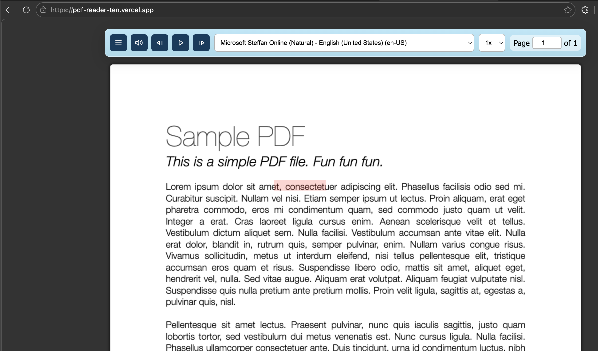

# Book Reader



Main feature of this reader is to use read aloud feature for free.

Right now only pdf format is supported.

### Works on Edge Browser only

## How to Use?

- Open pdf.html
- Upload PDF
- Click on Read Aloud Button (Need Internet)

## Todo:

- [ ] Add Resize Page Buttons
- [ ] Skip Header/footers,vertical text,text in brackets
- [ ] Make responsive
- [ ] Create Extension
- [ ] Create Mobile App
- [ ] Make links clickable
- [ ] Try base64
- [ ] Use Canvas.before insert method to add textlayer

## Contribute to development

```bash
# Clone repository
$ git clone https://github.com/Harsh-0-7/Book-Reader.git

# Move to working directory
$ cd Book-Reader

# Install dependencies
$ npm install
```

## Have you found a bug?

Please open a new issue on:

https://github.com/Harsh-0-7/Book-Reader/issues

## License

Copyright (c) Harsh Shah

[MIT License](http://en.wikipedia.org/wiki/MIT_License)
