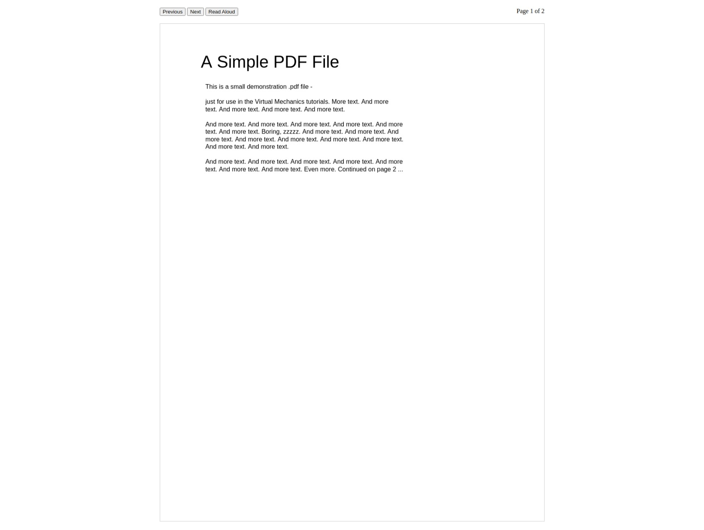

# Book Reader



Main feature of this reader is to use read aloud feature for free.

Right now only pdf format is supported.

## How to Use?

- Open pdf.html
- Upload PDF
- Click on Read Aloud Button (Need Internet)

## Todo:

1. Skip Header/footers,vertical text,text in brackets
2. Highlight word/sentence which is being spoken
3. Make responsive
4. Add Resize Page Buttons
5. Create Extension
6. Create Mobile App
7. ??

## Contribute to development

```bash
# Clone repository
$ git clone https://github.com/Harsh-0-7/Book-Reader.git

# Move to working directory
$ cd Book-Reader

# Install dependencies
$ npm install
```

## Have you found a bug?

Please open a new issue on:

https://github.com/Harsh-0-7/Book-Reader/issues

## License

Copyright (c) Harsh Shah

[MIT License](http://en.wikipedia.org/wiki/MIT_License)
