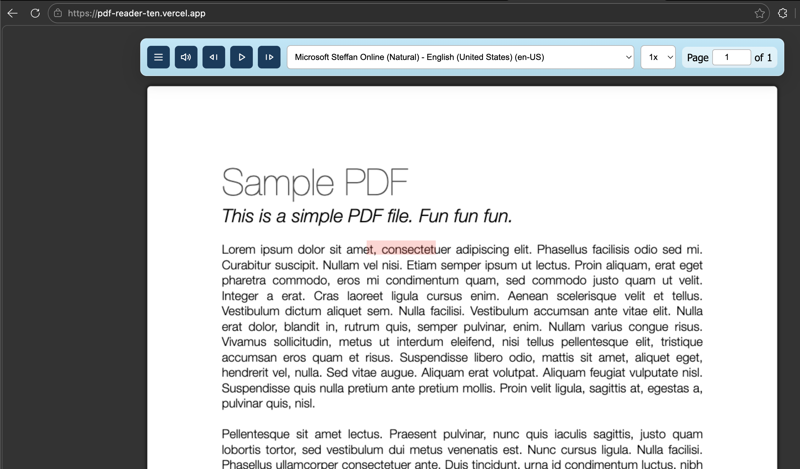

# PDF Reader



Main feature of this reader is to use read aloud feature for free.

### Some voices in chrome might not support text highlighting sync.

## How to Use?

- Open index.html
- Upload PDF
- Click on Read Aloud Button (Need Internet for good voices)

## Todo:

- [ ] Add Resize Page Buttons
- [ ] Skip Header/footers,vertical text,text in brackets
- [ ] Make responsive
- [ ] Try base64
- [ ] Use Canvas.before insert method to add textlayer
- [ ] Research on other free ways to get better tts or text highlighting sync
- [ ] Integrate Open AI tts models with text highlighting sync
- [ ] Upgrade pdf.js version
- [ ] Use better text highlighting syncing strategy
- [ ] Support sentence/paragraph level highlighting
- [ ] Use service workers to improve performance
- [ ] Use Cache/indexeddb for storing render pages for better performance
- [ ] Add support for article/blogs/pdf web links

## Contribute to development

```bash
# Clone repository
$ git clone https://github.com/Harsh-0-7/PDF-Reader.git

# Move to working directory
$ cd PDF-Reader

# Open index.html
```

## Have you found a bug?

Please open a new issue on:

https://github.com/Harsh-0-7/PDF-Reader/issues

## License

Copyright (c) Harsh Shah

[MIT License](http://en.wikipedia.org/wiki/MIT_License)
